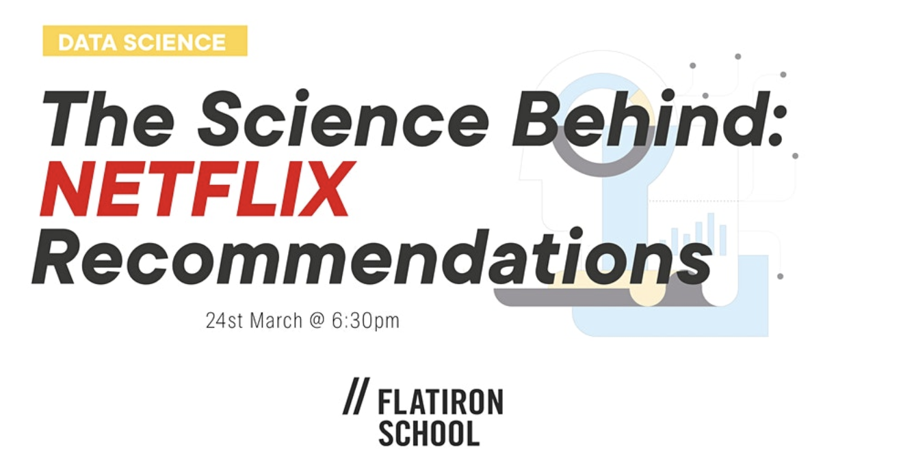

# The Science of Netflix

A code along workshop for the Flatiron School Meetup [The Science Behind Netflix Recommendations : Talk | London](https://www.eventbrite.com/e/virtual-the-science-behind-netflix-recommendations-talk-london-tickets-96698721479).
The [original materials for this workshop](https://github.com/yishuen/meetup-movie-recommender) were developed by Flatiron NYC Coach [Yish Lim](https://www.linkedin.com/in/yishuen-lim/) and were adapted for online Zoom broadcast by [David John Baker](https://github.com/davidjohnbaker1/science-of-netflix).

This version of the workshop is being presented on:

* March, 24th 2020 and can be accessed [here via Zoom](https://wework.zoom.com/j/227461308) 

You can access the [slides from here]().

You can access our [collaborative document here]().

The dataset used is **The Movies Dataset** found on Kaggle, specifically from the file `ratings small.csv`: https://www.kaggle.com/rounakbanik/the-movies-dataset

If you do want to run the code on your own, download Jupyter Notebook and run these lines in your terminal:

 1. `git clone https://github.com/davidjohnbaker1/science-of-netflix.git`
 2. `cd science-of-netflix`
 3. `jupyter notebook`

## Additional Readings and Resources:

Yish has wrote a couple posts on Medium about recommendation engines: https://medium.com/@yishuen
- [A Primer to Recommendation Engines](https://towardsdatascience.com/a-primer-to-recommendation-engines-49bd12ed849f)
- [Collaborative Filtering on Utility Matrices](https://towardsdatascience.com/math-for-data-science-collaborative-filtering-on-utility-matrices-e62fa9badaab)

If you want to read more about the math behind SVD, check out Chapter 9. We highly *recommend* it if you want to understand how SVD works using gradient descent + alternating least squares.
- http://infolab.stanford.edu/~ullman/mmds/book.pdf

Here are some other links to podcast episodes on recommendation engines:
- Data Skeptic: http://dataskeptic.libsyn.com/recommender-systems-live-from-farcon-2017
- Linear Digressions: http://lineardigressions.com/episodes/2017/6/25/factorization-machines

[Feel free to reach out to either Yish](https://www.linkedin.com/in/yishuen-lim/) or [Dave if you have any questions](https://www.linkedin.com/in/david-john-baker-phd/) 

